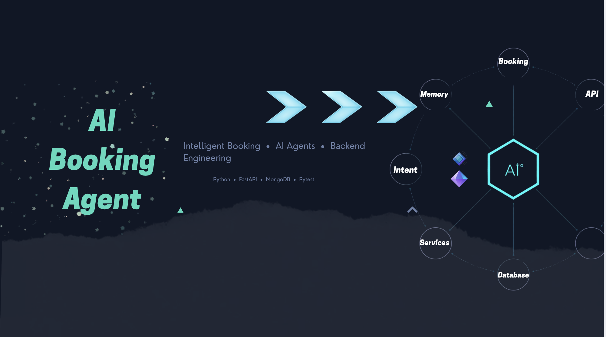

<p align="center">
  
</p>

<h1 align="center">AI Booking Agent</h1>

<p align="center">
  <strong>Backend-first intelligent booking system evolving into a reusable AI agent.</strong>
</p>

<p align="center">
  Built with FastAPI, MongoDB, PyMongo, Pydantic and Pytest.
</p>

<p align="center">
  
  
  
  
  
  
  
</p>

---

## Overview

**AI Booking Agent** is a reusable booking backend designed to evolve into an AI-powered booking agent.

The project is intentionally developed **backend-first** so that booking rules, scheduling, availability, staff assignment, conflict detection, validation, conversation state, context management, AI decisions, and controlled tool execution are reliable before introducing an external LLM.

```text
User / Client
      ↓
FastAPI
      ↓
Conversation API / Booking API
      ↓
Conversation Service / AI Core / Booking Engine
      ↓
Validation & Business Rules
      ↓
Repository Layer
      ↓
MongoDB
```

The AI layer interacts with the application through explicit business tools rather than accessing MongoDB directly. This keeps AI interpretation separate from deterministic booking rules and persistence.

---

## Current Status

| Phase | Status |
|---|---|
| Phase 1 — Foundation | ✅ Completed |
| Phase 2 — API & MongoDB Foundation | ✅ Completed |
| Phase 3 — Booking System | ✅ Completed |
| Phase 4 — Customers, Staff & Availability | ✅ Completed |
| Phase 5 — Booking Engine Expansion | ✅ Completed |
| Phase 6 — Conversation System | ✅ Completed |
| Phase 7 — AI Core & Controlled Execution | ✅ Completed |
| Phase 8 — AI Business Tools | ✅ Completed |
| Phase 9 — LLM Integration | ➡️ Next |
| Phase 10 — Production Engineering | Planned |

Current automated test status:

```text
209 passed
1 warning
0 failures
```

The remaining warning is a FastAPI/Starlette TestClient dependency deprecation warning and does not represent a failing test.

---

## Implemented Features

### Booking

- [x] Create bookings
- [x] Retrieve all bookings
- [x] Retrieve booking by ID
- [x] Partial booking updates
- [x] Validated rescheduling
- [x] Booking cancellation
- [x] Booking status lifecycle
- [x] Confirmed-booking filtering
- [x] Cancelled-slot reuse
- [x] Conflict-aware creation and rescheduling
- [x] Self-conflict exclusion during updates

### Booking Engine

- [x] Centralized booking validation
- [x] Service validation
- [x] Business-hours validation
- [x] Staff validation
- [x] Service-to-staff validation
- [x] Staff availability validation
- [x] Booking conflict detection
- [x] Staff-aware conflict detection
- [x] Booking creation orchestration
- [x] Booking update and rescheduling orchestration
- [x] Booking cancellation orchestration
- [x] Repository-backed execution
- [x] Shared HTTP error mapping

### Availability & Scheduling

- [x] Business-hours validation
- [x] Full service-duration validation
- [x] Booking overlap detection
- [x] Double-booking prevention
- [x] Back-to-back booking support
- [x] Persistent availability configuration
- [x] Staff-specific working schedules
- [x] Staff availability validation
- [x] Staff-specific booking conflicts
- [x] Available time-slot generation
- [x] Occupied-slot exclusion
- [x] Available-slots API

### Customers

- [x] Customer schema and validation
- [x] Customer repository
- [x] Customer API
- [x] Active customer filtering

### Staff

- [x] Staff schema and validation
- [x] Staff repository
- [x] Staff API
- [x] Service-to-staff relationships
- [x] Staff lookup by service
- [x] Staff-specific availability

### Conversation System

- [x] Conversation and message schemas
- [x] User, assistant, and system message roles
- [x] Conversation persistence
- [x] Message persistence
- [x] Ordered conversation history
- [x] Conversation isolation
- [x] Conversation state
- [x] Booking context
- [x] Partial context updates
- [x] Existing-context preservation
- [x] Conversation service
- [x] Conversation-to-booking conversion
- [x] Booking-engine integration
- [x] Conversation REST API
- [x] Active-intent persistence
- [x] Multi-turn booking continuation
- [x] Multi-turn availability continuation

### AI Core

- [x] Intent detection
- [x] Entity extraction
- [x] Entity resolution
- [x] Context preparation
- [x] Existing-context merging
- [x] Missing-field detection
- [x] Structured AI decisions
- [x] Decision engine
- [x] Response generation
- [x] AI orchestration
- [x] Controlled business-action selection
- [x] Tool executor
- [x] Conversation-to-tool execution
- [x] No direct AI access to MongoDB

### AI Business Tools

The controlled execution layer currently exposes:

```text
GET_SERVICES        → get_services()
GET_STAFF           → get_staff()
GET_AVAILABLE_TIMES → get_available_times()
CREATE_BOOKING      → execute_booking_from_conversation()
```

The decision layer maps supported intents to explicit business actions:

```text
BOOK               → CREATE_BOOKING
CHECK_AVAILABILITY → GET_AVAILABLE_TIMES
GET_SERVICES       → GET_SERVICES
GET_STAFF          → GET_STAFF
```

Availability requests require:

```text
service_id
staff_id
booking_datetime
```

Booking requests require:

```text
service_id
customer_name
customer_phone
booking_datetime
```

If required information is missing, the system returns `ASK_USER`.

When the required context is complete, the decision layer returns `CALL_TOOL` with an approved `BusinessAction`.

---

## Architecture

```text
AI Booking Agent
│
├── ai_core/
│   ├── __init__.py
│   ├── availability.py
│   ├── available_slots.py
│   ├── booking_engine.py
│   ├── business_action.py
│   ├── business_tools.py
│   ├── context_preparation.py
│   ├── conversation_service.py
│   ├── decision.py
│   ├── decision_engine.py
│   ├── entities.py
│   ├── entity_extractor.py
│   ├── entity_resolver.py
│   ├── intent.py
│   ├── intent_detector.py
│   ├── missing_fields.py
│   ├── missing_information.py
│   ├── orchestrator.py
│   ├── resolved_entities.py
│   ├── response_generator.py
│   ├── staff_availability.py
│   └── tool_executor.py
│
├── api/
│   ├── main.py
│   ├── http_errors.py
│   ├── routes/
│   │   ├── services.py
│   │   ├── bookings.py
│   │   ├── conversations.py
│   │   ├── customers.py
│   │   └── staff.py
│   └── schemas/
│       ├── service.py
│       ├── booking.py
│       ├── conversation.py
│       ├── availability.py
│       ├── customer.py
│       ├── staff.py
│       └── staff_availability.py
│
├── database/
│   ├── connection.py
│   └── repositories/
│       ├── services.py
│       ├── bookings.py
│       ├── conversations.py
│       ├── messages.py
│       ├── availability.py
│       ├── customers.py
│       ├── staff.py
│       └── staff_availability.py
│
├── tests/
├── docs/
├── .env.example
├── .gitignore
└── README.md
```

### Layered Flow

```text
Client
   ↓
FastAPI
   ↓
API Routes
   ↓
Pydantic Validation
   ↓
Conversation Service / AI Core / Booking Engine
   ↓
Business Rules & Orchestration
   ↓
Repository Layer
   ↓
MongoDB
```

### AI Conversation Flow

```text
User Message
      ↓
Intent Detection
      ↓
Entity Extraction
      ↓
Entity Resolution
      ↓
Context Preparation
      ↓
Merge With Existing Context
      ↓
Decision Engine
      ↓
ASK_USER / CALL_TOOL / UNKNOWN
      ↓
Response Generator / Tool Executor
      ↓
Business Tools / Booking Engine
      ↓
Repositories
      ↓
MongoDB
```

The architecture keeps HTTP routing, conversation state, AI decisions, booking rules, execution, and persistence separated.

---

## API

### Health

```http
GET /health
```

Provides a basic application health check.

### Services

```http
GET /services
```

Returns active services used by booking and AI workflows.

### Bookings

```http
POST  /bookings
GET   /bookings
GET   /bookings/{booking_id}
PATCH /bookings/{booking_id}
PATCH /bookings/{booking_id}/cancel
```

Booking operations pass through application-level business rules before persistence.

```text
Booking Request
      ↓
Service Validation
      ↓
Business Hours
      ↓
Staff Validation
      ↓
Service-to-Staff Relationship
      ↓
Staff Availability
      ↓
Conflict Detection
      ↓
Create / Update Booking
```

Conflicting reservations return:

```text
409 Conflict
```

### Booking Rescheduling

`PATCH /bookings/{booking_id}` supports partial updates through `BookingUpdate`.

```text
Retrieve Existing Booking
      ↓
Merge Existing + Updated Fields
      ↓
Build Candidate Booking
      ↓
Validate Candidate
      ↓
Exclude Current Booking
      ↓
Apply Update
```

The existing booking is excluded from its own conflict check, preventing false self-conflicts while still protecting against collisions with other reservations.

### Conversations

```http
POST  /conversations
GET   /conversations/{conversation_id}
POST  /conversations/{conversation_id}/messages
GET   /conversations/{conversation_id}/messages
PATCH /conversations/{conversation_id}/booking-context
POST  /conversations/{conversation_id}/bookings
```

A conversation maintains an independent booking context:

```text
BookingContext
├── service_id
├── customer_name
├── customer_phone
├── booking_datetime
└── staff_id
```

All fields are optional while information is being collected.

Partial updates preserve previously collected values.

Messages are stored independently from the conversation document so conversation history can grow without continuously expanding one MongoDB document.

### Staff

```http
GET /staff
GET /staff/{staff_id}
```

Staff members can be linked to services and assigned individual working schedules.

### Available Time Slots

```http
GET /staff/{staff_id}/available-slots
```

Slot generation considers:

- Staff schedules
- Requested service duration
- Confirmed staff bookings
- Conflict rules
- Scheduling boundaries

---

## AI Core & Controlled Execution

The AI Core acts as a deterministic decision layer between conversational input and backend business logic.

```text
AI Core
│
├── Intent Detection
├── Entity Extraction
├── Entity Resolution
├── Context Preparation
├── Missing-Field Detection
├── Decision Engine
├── Response Generation
├── Orchestration
└── Controlled Tool Execution
```

Conversational next actions and backend business actions are represented separately.

### Next Actions

```text
ASK_USER
UPDATE_CONTEXT
CALL_TOOL
COMPLETE
UNKNOWN
```

### Business Actions

```text
CREATE_BOOKING
GET_SERVICES
GET_STAFF
GET_AVAILABLE_TIMES
```

### Availability Example

```text
Intent: CHECK_AVAILABILITY
      ↓
Required Context Complete?
      ↓
CALL_TOOL
      ↓
GET_AVAILABLE_TIMES
      ↓
Tool Executor
      ↓
Business Tool
      ↓
Existing Availability Logic
```

### Booking Example

```text
Intent: BOOK
      ↓
Required Context Complete?
      ↓
CALL_TOOL
      ↓
CREATE_BOOKING
      ↓
Conversation Context
      ↓
BookingCreate
      ↓
Booking Engine
      ↓
Validation
      ↓
Repositories
      ↓
MongoDB
```

The Tool Executor does not grant the AI direct database access.

Booking creation continues through the Booking Engine, and business tools reuse existing repository and scheduling logic.

---

## Multi-Turn Conversation Processing

The conversation system can preserve an active workflow across multiple messages.

Example:

```text
User:
I want to book Haircut

      ↓

Intent:
BOOK

      ↓

Missing Information
      ↓
ASK_USER
```

A later message can provide the missing information without repeating the original booking intent.

When the required context becomes complete:

```text
Complete Context
      ↓
Decision Engine
      ↓
CALL_TOOL
      ↓
Business Action
      ↓
Tool Executor
      ↓
Booking Engine / Business Tool
```

The same continuation mechanism supports availability requests through persisted `active_intent`.

---

## Core Booking Rules

### Scheduling

The complete service duration must fit within the configured availability window.

Example:

```text
Business Hours:
09:00 → 17:00

60-minute service:

16:00 → 17:00   ✓
16:30 → 17:30   ✗
```

### Conflict Detection

Conflict detection uses time intervals rather than exact start-time equality.

```text
Existing:
10:00 → 11:00

Requested:
10:30 → 11:30

Result:
CONFLICT
```

The engine detects:

- Partial overlap
- Contained intervals
- Containing intervals
- Identical intervals

### Back-to-Back Bookings

Adjacent reservations are allowed.

```text
Booking A:
10:00 → 11:00

Booking B:
11:00 → 12:00

Result:
No Conflict
```

### Staff-Aware Scheduling

When a staff member is selected:

```text
Staff Exists
      ↓
Supports Service
      ↓
Is Working
      ↓
Has No Conflicting Booking
```

### Booking Lifecycle

```text
Created
   ↓
confirmed
   ↓
Cancel
   ↓
cancelled
```

Confirmed bookings occupy scheduling slots.

Cancelled bookings release their slots while preserving booking history.

### Conversation State vs Booking Status

Conversation state:

```text
active
completed
```

Booking status:

```text
confirmed
cancelled
```

These lifecycles remain separate to avoid mixing conversation concerns with booking-domain rules.

---

## Validation & Error Handling

Input validation is handled with Pydantic.

Schema-level validation includes:

- Required and typed identifiers
- Customer name and phone constraints
- Datetime parsing
- Controlled booking status values
- Controlled day-of-week values
- Availability time ranges
- Controlled message roles
- Message content validation
- Partial `BookingContext` validation

Application-level validation protects against:

- Missing services
- Bookings outside business hours
- Bookings extending beyond closing time
- Missing staff
- Unsupported staff-service combinations
- Unavailable staff
- Overlapping confirmed reservations
- Conflicting rescheduling
- Missing conversations
- Incomplete booking context
- Incomplete availability context
- Unsupported AI business actions

Booking-related HTTP errors are centralized in:

```text
api/http_errors.py
```

Examples:

| Error | HTTP Result |
|---|---|
| Service not found | `404 Not Found` |
| Conversation not found | `404 Not Found` |
| Booking conflict | `409 Conflict` |
| Outside business hours | `422 Unprocessable Entity` |
| Incomplete booking context | `422 Unprocessable Entity` |

---

## Testing

The project uses Pytest and FastAPI testing utilities.

Run the full suite:

```bash
python -m pytest -v
```

Current result:

```text
209 passed
1 warning
0 failures
```

Testing covers:

```text
API & Schemas
├── Health
├── Services
├── Bookings
├── Customers
├── Staff
└── Conversations

Booking Domain
├── Validation
├── Conflict Detection
├── Creation
├── Rescheduling
├── Cancellation
├── Staff Availability
└── Available Slots

Conversation System
├── Persistence
├── History
├── State
├── Booking Context
├── Context Preservation
├── Booking Execution
├── Active Intent
└── Multi-Turn Continuation

AI Core
├── Intent Detection
├── Entity Extraction
├── Entity Resolution
├── Context Preparation
├── Missing Information
├── Decision Engine
├── Orchestration
├── Response Generation
├── Business Tools
└── Tool Execution

Integration
├── Conversation → Booking Engine
├── AI Decision → Business Tool
└── Full Regression Suite
```

The full regression suite is run after booking, scheduling, conversation, AI Core, and integration changes.

---

## Technology Stack

| Technology | Purpose |
|---|---|
| Python 3.13 | Core language |
| FastAPI | REST API |
| MongoDB | NoSQL database |
| PyMongo | MongoDB driver |
| Pydantic | Data validation |
| Pytest | Automated testing |
| Uvicorn | ASGI development server |
| Git / GitHub | Version control |

### Planned

- LLM API
- Structured LLM outputs
- Controlled LLM tool calling
- Guardrails
- Docker
- GitHub Actions
- Logging
- Deployment preparation
- Optional React dashboard

---

## Development Roadmap

### Phase 1 — Foundation

**Completed**

Repository structure, Git configuration, project scope, and domain documentation.

### Phase 2 — API & MongoDB Foundation

**Completed**

FastAPI, MongoDB, PyMongo, repositories, schemas, and initial automated tests.

### Phase 3 — Booking System

**Completed**

Booking CRUD, lifecycle management, validation, cancellation, persistence, and API testing.

### Phase 4 — Customers, Staff & Availability

**Completed**

Customer and staff management, service relationships, availability, staff schedules, conflicts, slot generation, APIs, and regression tests.

### Phase 5 — Booking Engine Expansion

**Completed**

Centralized booking validation and orchestration for creation, updates, rescheduling, cancellation, staff-aware scheduling, conflicts, and shared HTTP error mapping.

### Phase 6 — Conversation System

**Completed**

Persistent conversations, messages, history, state, `BookingContext`, partial updates, conversation services, REST APIs, and Booking Engine integration.

### Phase 7 — AI Core & Controlled Execution

**Completed**

Intent detection, entity extraction and resolution, context preparation, missing-information detection, structured decisions, orchestration, response generation, business-action selection, and controlled execution.

### Phase 8 — AI Business Tools

**Completed**

Implemented controlled reusable tools and decision routing for:

```text
get_services
get_staff
get_available_times
create_booking
```

Also completed:

- Intent-to-business-action routing
- Context requirements per supported workflow
- Controlled execution through existing backend logic
- Multi-turn availability continuation
- Business-tool regression tests
- Decision-engine regression tests
- Conversation-service regression tests
- Full regression validation

Final Phase 8 architecture:

```text
User Message
      ↓
AI Core
      ↓
Decision Engine
      ↓
Business Action
      ↓
Tool Executor
      ↓
Business Tool / Booking Engine
      ↓
Validation & Business Rules
      ↓
Repositories
      ↓
MongoDB
```

No AI component writes directly to MongoDB.

### Phase 9 — LLM Integration

**Next**

Planned:

- LLM API integration
- Structured model outputs
- Controlled tool calling
- Prompt design
- Guardrails
- Deterministic backend validation after model decisions
- Fallback handling for invalid or unsupported model output
- Tests around the LLM boundary

The LLM will interpret natural language and request approved tools while deterministic application logic remains responsible for validation and execution.

### Phase 10 — Production Engineering

**Planned**

- Docker
- GitHub Actions
- Continuous Integration
- Security validation
- Logging
- Deployment preparation

A React dashboard may be added as a presentation layer without changing backend business rules.

---

## Local Development

### Clone

```bash
git clone https://github.com/Danakaabi/ai-booking-agent-.git
cd ai-booking-agent
```

### Create Virtual Environment

```bash
python -m venv .venv
source .venv/bin/activate
```

### MongoDB

Verify that MongoDB is available:

```bash
mongosh --eval 'db.runCommand({ ping: 1 })'
```

Expected:

```text
{ ok: 1 }
```

MongoDB must be running before repository and integration tests.

### Run API

```bash
uvicorn api.main:app --reload
```

Swagger documentation:

```text
http://127.0.0.1:8000/docs
```

### Run Tests

```bash
python -m pytest -v
```

Current expected result:

```text
209 passed
1 warning
0 failures
```

---

## Current Development Focus

```text
Foundation                         ✓
FastAPI + MongoDB                  ✓
Booking System                     ✓
Availability & Scheduling          ✓
Customers & Staff                  ✓
Booking Engine                     ✓
Conversation System                ✓
Intent Detection                   ✓
Entity Extraction & Resolution     ✓
Context Preparation                ✓
Missing Information                ✓
Decision Engine                    ✓
Response Generation                ✓
AI Orchestration                   ✓
Controlled Tool Execution          ✓
AI Business Tools                  ✓
Multi-Turn Availability            ✓
Full Regression                    ✓

LLM Integration                    → NEXT
Production Engineering
Dashboard / UI                     → LATER
```

The current objective is:

> **Integrate an LLM at a controlled boundary while preserving deterministic backend validation and explicit tool execution.**

---

## Target AI Architecture

```text
Client
   ↓
FastAPI
   ↓
Conversation System
   ↓
LLM Boundary
   ↓
AI Core
   ↓
Controlled Business Tools
   ↓
Booking Engine
   ↓
Validation & Scheduling Rules
   ↓
Repositories
   ↓
MongoDB
```

The AI layer will determine:

- What does the user mean?
- Which approved operation is needed?
- What information is still missing?
- Which controlled tool should be requested?

The deterministic backend determines:

- Is the operation allowed?
- Is the context complete?
- Does it satisfy booking rules?
- How should it be executed?

The database persists only validated results.

---

## Why Backend-First?

The project deliberately does not begin with an LLM.

A booking agent must reliably answer questions such as:

- Does the service exist?
- Does the staff member provide it?
- Is the business open?
- Is the staff member working?
- Does the full service duration fit?
- Does another confirmed booking overlap?
- Can this booking be safely rescheduled?
- Is the conversation context complete?

These decisions should not depend on probabilistic model output.

The LLM can therefore be introduced as an interpretation layer without becoming the authority for booking rules or persistence.

---

## Engineering Principles

- Separation of concerns
- Repository pattern
- Centralized booking orchestration
- Dedicated conversation service
- Validation at application boundaries
- Deterministic scheduling
- Conflict-safe booking operations
- Persistent conversation state
- Partial booking-context collection
- Structured AI decisions
- Explicit business-action routing
- Controlled tool execution
- Shared HTTP error mapping
- Automated regression testing
- Framework-independent business logic
- No direct AI access to MongoDB
- No secrets committed to Git

---

## Long-Term Vision

The project is intended to evolve into a reusable AI booking agent for domains such as:

- Salons
- Clinics
- Healthcare scheduling
- Events
- Professional services
- Appointment-based businesses

```text
Web / Mobile / Chat / Dashboard
              ↓
      Conversation / AI Layer
              ↓
        Business Tools
              ↓
        Booking Engine
              ↓
          Scheduling
              ↓
           MongoDB
```

The same deterministic Booking Engine, conversation infrastructure, AI Core, and controlled tools can support multiple interfaces without duplicating business rules.

---

## Project Philosophy

> **AI should interpret and reason about the request.**
>
> **Conversation infrastructure should preserve context and state.**
>
> **Business logic should decide what is allowed.**
>
> **Controlled tools should execute approved operations.**
>
> **The database should persist only validated results.**

---

<p align="center">
  <strong>AI Booking Agent</strong><br>
  Backend Engineering • Booking Systems • Scheduling • Conversation Systems • AI Agents • System Design
</p>